原文链接：[Bonds of Matrimony](https://www.seriousbondage.com/Article-BondsOfMatrimony/)

January, 2015

By ThisGirl, Introduction by Petgirl_Koko

Many people from all walks of life come through the doors of the Serious Bondage Institute. We get to hear different stories of people's love of kink and their relationships. This is one of those stories. In 2011 we had the honor of meeting Grimly and his partner ThisGirl during their visit to the Folsom Street Fair in San Francisco. We quickly connected and they helped make it a Folsom event for all of us to remember. It turned out that they were actually on their honeymoon, and the story of their wedding is one of a bold and kinky couple who made their dream wedding come true. I'm sure many people would love to have a wedding like the one described in this article, but how many of those couples would have the courage to really make it happen?

  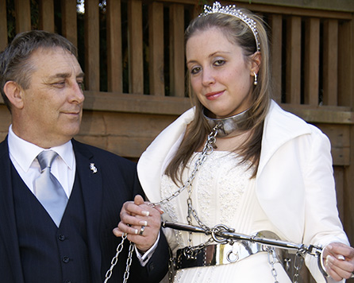
  
In this article we find that love and kink become one.

During their stay in San Francisco, they told stories of their wedding but they only had a few photos to show us. We were so intrigued by this unusual tale that we encouraged ThisGirl to write it up for us once they got back to their home in the UK. What follows is the story of their kinky wedding and honeymoon, accompanied by a wonderful selection of photos.

So much of the interaction between bondage enthusiasts takes place over the internet and it is rare that any of us get to meet those who share our passion, let alone to spend days visiting with them and playing together. As you will see, ThisGirl and her sweetheart wanted to create a real-life kinky vacation, and used getting married as the perfect excuse to pull out all the stops. It obviously took a lot of planning and coordination, but I think I can speak for all of those who hosted them on their North American kink trip when I say that it was really fun to hang out with them and to participate in so many outrageous bondage scenes.

You can tell that these two people really love each other and love indulging each others kinks to the fullest. They easily won our hearts during their visit, and we still keep in contact with them today. As a matter of fact, we plan to visit them in the UK very soon, and look forward to seeing both them and their playroom which they keep telling us about. This will be the first of our travels for shooting video in other cities, states and countries. We hope you enjoy their love story and the kinky adventures that they were kind enough to share with all of us.

## Part 1 - Tying The Knot

Grimly and I had been together seven years when we decided marriage seemed the logical next step to testify to our love and commitment to one another. Given that we met through [Informed Consent](http://www.informedconsent.org.uk/) (the UK equivalent of Fetlife) we both knew we were meeting someone with shared interests, and therefore I feel quite fortunate that I will never have a husband who says 'my wife doesn't understand me'! 

Despite that, when we met I wasn't actually looking for a relationship, but for someone to explore with me the fantasies I'd had for the past 10 years or so. I'd always dreamed of being the kidnapped and tortured heroine in all kinds of scenarios from the medieval to the wartime and the futuristic. I can’t explain where those ideas came from - possibly movies and books - but either way they were in my head and I wanted them to be real, or at least to feel as real as they could. Whilst I'd met Doms locally, the majority of the kink here in Scotland is very much all about dressing up and then being tied up and flogged or caned in the local fetish club. I wanted more than that, and with the right ambiance and amount of adrenaline present.

Grimly introduced me to many of the things I'd dreamed about, including electrics and sensory overload, his signature piece being a dentist chair which has built-in restraints, electrical points, suction and a fuck machine. No wonder, really, that I fell in love. (Details about our equipment can be found on my blog website [HERE](http://www.thisgirl.wordpress.com/), and visit our retail website [HERE](http://www.lockedforinfinity.com/)).

Our actual wedding was very civilized, but we felt it only right to have a bit of fun with the wedding dress and to do what possibly lots of wedding couples have fantasized about.

  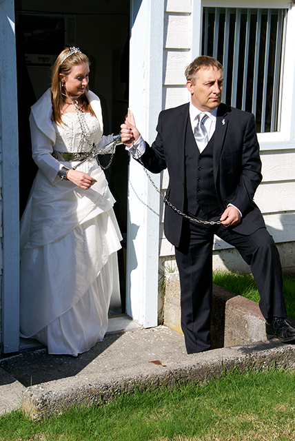
  
On our way out into the garden to take our vows. I would follow him anywhere... and obviously, I'd have to under the circumstances. I'll just have to 'follow suit'.

The restraints pictured were made for JG-Leathers by the folks over at [Axsmar](https://www.axsmar.eu/). I was adorned with wrist and ankle cuffs, a steel collar, a waist belt, and of course a good old ball and chain! (…And lots more chain!)

  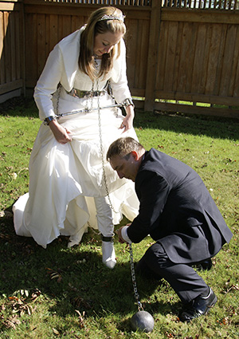
  
Yes, we couldn't resist complying with the 'old ball and chain' joke. It was the perfect chance to go for it. Grimley made frequent adjustments to ensure i wasn't going anywhere.

  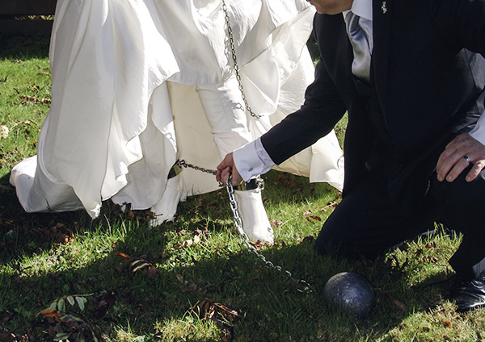
  
This closeup shows the shiny steel chain linking my ankle cuffs - we both loved the ringing sound of the chain as I walked down the aisle. Best foot forward!

Later on, Grimly decided to add the nose hook. The [Axsmar](https://www.axsmar.eu/) nose hook is a delicious bondage piece of kit, and whilst it is subtle and delicate, it is very effective in making sure the wearer does not run away, since a small tug on the chain is a reminder that escape could hurt. 

  

  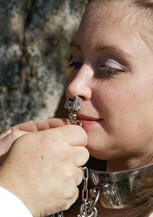
  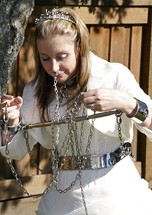
  

  
There was no chance I was getting 'off the hook' at any point on our wedding day! That was a lot of chain and gear to manage along with the long wedding dress.

  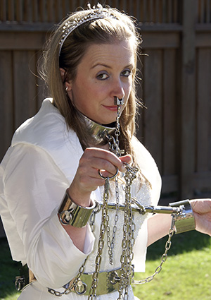
  
I love bondage - it's as plain as the nose on my face!

Of course, every wedding comes with a drink for the groom to make a toast, so Grimly strapped me into the system gag he made with the drink holder attachment. I'll leave it to your imagination as to what he had to say about his bride in bondage! Being out on the deck in the sun was quite hot in the dress and all that steel, and it was quite frustrating not being able to move very much. 

  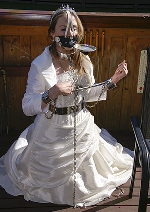
  
The bride on her knees - our wedding reception was a little different and we wouldn't have it any other way.

The nose hook went quite well with the system gag, and left me with no option but to wait until he had finished his drink. The gag comes with other attachments as well, including a duster and a cleaning brush – surely he doesn't expect his wife to do any housework!

  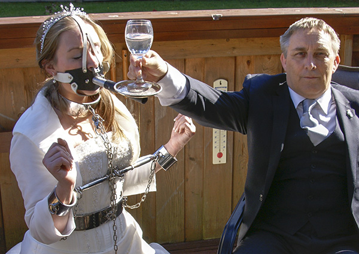
  
The guests enjoyed the best man's speech, and then all raised their glasses to the happy (kinky) couple!

As I looked up adoringly at her new husband, I marveled that we found each other. It's a weird thing that a love of kink brought us together, because there is a lot more to our relationship than what I can explain here. Grimly has done things to me that I've loved, but also sometimes that I've hated, or at least, loved to hate! I can assure you there are pictures of me where the look on my face says it all... let's just say, 'if looks could kill, he'd be six feet under'! The thing is, though, that those have been things I've wanted to happen as part of my journey of sensory exploration. I see BDSM and bondage as a bit of an addiction really, constantly seeking the next thing to try, or the new idea to bring to live, or the new toy to splash money on. (In that regard, I have a bit of a problem, and need to show more restraint in spending.)

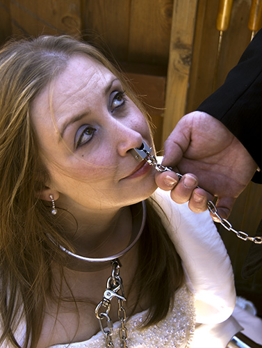

However, the thing is, all of that is just to enjoy something we both share an interest in, and that indulges the fantasies of both of us. It's not just for me, and not just for him. Mostly, bondage puts a smile on my face and on his as well. So we'll keep doing it as long as that remains the case. Bound together for life, till we're old and grey - or, in his case, grayer!

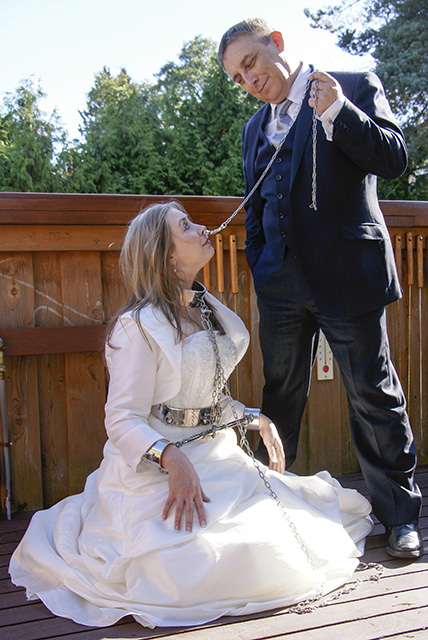
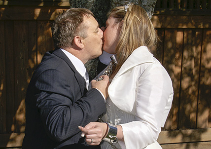

## Part 2 - Enjoying the Bonds of Matrimony

After the ceremony comes - the honeymoon! Where to go? Well, three years ago, on our first trip to Canada, we had hooked up with [JG-Leathers](http://jg-leathers.com/) and were invited over to visit his place for me to try "[The Creature](http://www.seriousbondage.com/Article-TheCreature/)". Not long after, we were engaged on JG's back deck with many of the local kinksters present. It felt kind of fitting to return, so we were off to Canada for our honeymoon, and for pretty much a month of kink!

I longed for another go in "The Creature" as a married woman! JG first became aware of Grimly and me when he saw pictures of the piece of kit that we have called 'The Chair', which does a very similar job to "The Creature", and he made contact with us to share ideas and experiences, which led to our first visit. It was so great to get to go back! It’s easy to explain why "The Creature" is such a fascination for so many kinky folk. For me, it embodies many of the fetishes I love. Heavy bondage, suspension, breath play, electricity, vacuum. Those things combined lead to sensory overload and exquisite torture. Something attracts me to the clinical and the sci-fi – perhaps films I've seen, or dreams I've had that have sparked my imagination – but maybe the main attraction is the aesthetics of it all.

  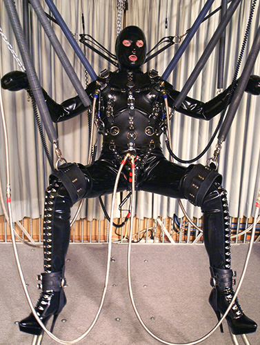
  
2009 photo of JG-Leathers in his Creature. Bondage, rubber, gas masks, e-stim and suction pumps are added to take the subject on a ride of maximum stimulation.

"The Creature" is first and foremost a design JG came up with for his own torments. To me, that makes it kinkier that he designed, created and implemented his own suffering. Whilst I have ideas aplenty, I do not have the skills to make them come to life like that, and after now being at both the controls and in the harness twice, I do feel as though the thing has a life of its own. I'd like to compare it to Frankenstein's monster, but I think that description falls a little short of what it really is.

Whilst we were planning our honeymoon and our trip over to see JG again, it was a very big fantasy of mine to be in control of "The Creature" with JG rattling around in the harness. I had been at the dials once before, but to see the creator of it jumping around because of my fingertips twiddling a few dials was something that was really exciting for me.

For the most part, I am a masochist, but every now and again I do like to experience things from the other side of the coin; there is a sadistic bitch inside that likes to be let out once in a while! So, I was very happy that JG gave me the opportunity to be evil to him! Some people might think this type of BDSM is easy, that it is not hands on, and that it's just about sitting on your bum, twisting buttons. This is not the case!

  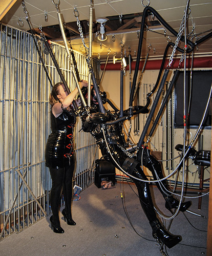
  
Here I am getting my victim JG into his infamous 'Creature'. I found that JG-Leathers is a 'creature' of habit.

Getting someone into the creature takes a great deal of time to ensure it is comfortable and secure, and then once everything is underway, it requires a great deal of vigilance to ensure everything is as it should be. It is no good to underestimate the amount of harm that can come from BDSM when it is misunderstood and entered into without an understanding of the equipment, and more importantly, the subject. I've had many conversations with JG, and I know that his desire is to experience everything in a full-on and fearless way. He wants what any masochist wants: to go as far as they can, and then a little bit beyond.

I have to be honest in that whilst I pushed and tormented him, I perhaps didn't go far enough, as I was concerned about going too far. For the first time doing it, though, I think I did okay! It's always a learning curve, playing with someone new. There's no such thing really of getting it right "first time, every time", and it's the experimentation aspect and learning things together that makes it all fun.

JG wasn't the only one to get harnessed up into "The Creature" whilst Grimly and I were on honeymoon. I had a turn as well, and I much prefer being the recipient of those torments. Perhaps being a masochist is a slightly greedy thing to be - I want to experience it all, and I want it to hurt enough to push me, enough to make me afraid and yet to still want more.

It's a long process to be fitted in the "Creature" gear. After everything was finally secured, I was taken outside into the back yard so JG could get some great photos of me in all the rubber and harnesses. Then it was just a matter of awaiting my fate at the hands of JG and my new husband.

  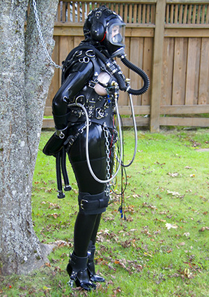
  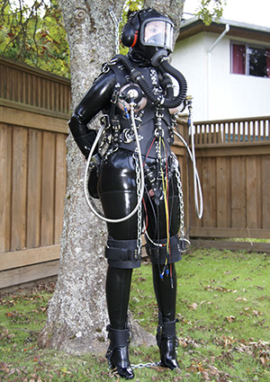
  
I've always wondered when I look at these pictures whether anyone was looking out of the neighbor's back window, checking me out! Would they be scared, or curious, or maybe envious?? I'll never know. 

The anxiety of it all built from the very first moment I was strapped into the harness. I wanted to back out and go and do something less freaky. But then I didn't. I wanted that fear and to feel as though there was no choice (when actually there was always a choice). Whilst I am an adrenaline junkie, I do always have that bit of self-doubt before a big event, where I get myself into knots and I need a sit-down to gather my thoughts together!

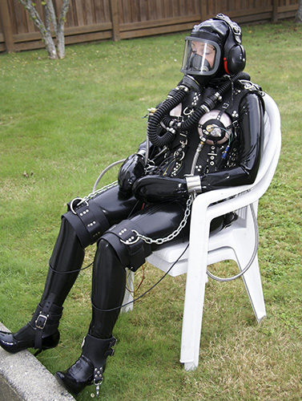

Sitting tight - it's quite a sensation spending time in the harness, but it's just the beginning of the experience.

Being in the harness is amazing, though. It fitted so perfectly, ensuring every part of me was encased in bondage and yet everything that was torturable and tormentable was either wired up or exposed for suction. There was nothing to do except wait. The Creature's harness is quite heavy, so having that on top of tight latex meant it was quite difficult to move very fast. Added to that, my breathing was restricted with a gas mask and tubes, so getting around was very difficult. It was only a matter of time before the fun and games began. At the beginning of setting the scene up, I was anxious and unsure if I was wanting to go ahead, but by the time I was standing under that tree I was ready to go and had found the right frame of mind where I just wanted to be plugged in and left in the hands of madmen. Always fun!

  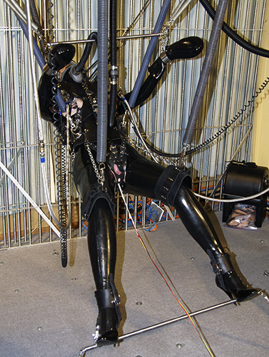
  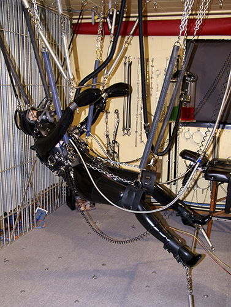
  
These pictures can't come close to conveying what it's like, bouncing around in "The Creature". It gives the word 'overload' a whole new meaning.

Whilst JG helped with the rigging, he left Grimly in charge of the controls and my torments. I'm unsure whether or not that can be classed as a favour! Once all the springs are connected, there is nothing really to do apart from bounce around at the mercy of the controller, hoping that he will grant mercy and release at the most optimum time! All of the senses are occupied. Touch, obviously, but also sight and sound are very limited and controlled as well. The noise the creature makes is terrifying and yet sexy at the same time. The workings of the machinery whizz around, muffling the screams. I suppose for someone like me, a fan of torture and sensory overload, it is close to being one of the best experiences ever, if not the best.

## San Francisco, here we come!

Our honeymoon did not stop there. After having a week in Canada, enjoying the hospitality of [JG-Leathers](http://jg-leathers.com/) and a vanilla trip to Whistler, I was delivered by Grimly and JG to the Serious Bondage Institute in San Francisco, where I was unpacked and entertained by MummyEd. I had expressed an interest in having a go in his travel chest, so I was dressed up in a latex skirt and latex boots and fitted with a gas mask whilst Ed prepared 3 mummies!

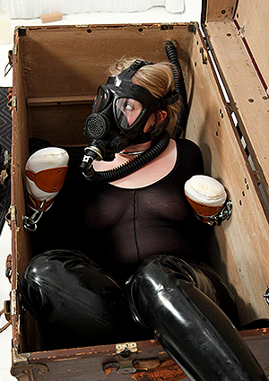

It was a really strange experience to listen to three guys being wrapped up in bandages and cling film whilst I was just trying to avoid a cramp and enjoy the predicament! I love isolation bondage, so I very much enjoyed the opportunity of just being left alone until they were all ready for me.

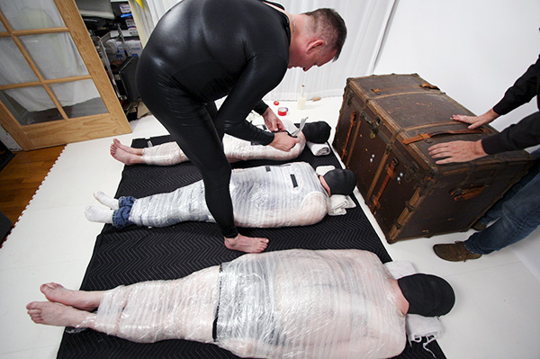

I spent quite a long time in the old wooden chest while Ed was fiddling about. MummyEd is a fantastic guy and a great friend. I would call him and equal-opportunity mummifier - he seems to enjoy mummifying anyone who happens to cross the Serious Bondage threshold. I'm kind of disappointed I didn't get to see him wrapping the guys up, and only saw the photos afterwards. The technique itself is interesting and exciting to watch, as the bondage gets tighter and the victim goes from man to mummy! The mummy labeled here on the right as 'OM' is another friend of mine, Daever, who I've spent some time with in Europe after our first meeting at the Serious Bondage Institute. Like many of my friends, he is weird, but lovely!

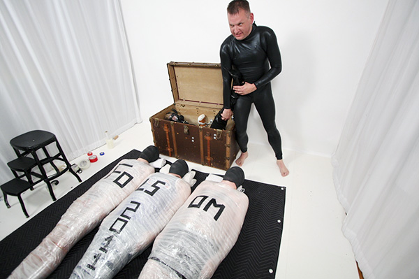

I was finally released Ed... what was he doing all this time?? Ah, I see - it was the advert for [Folsom Street Fair 2011]("http://www.folsomstreetfair.com/)! Let me be honest with you: we planned our whole wedding, or at least when it was going to take place, around Folsom. We needed an excuse to have an extended holiday, and getting married was an acceptable reason to give to my boss at work, rather than saying, 'Hi, let me go and be tied up in California!' We'd always wanted to go to Folsom and meet everyone at Serious Bondage, and I don't regret a moment of it. Nor do I mind being an advert for future bondage tourists!

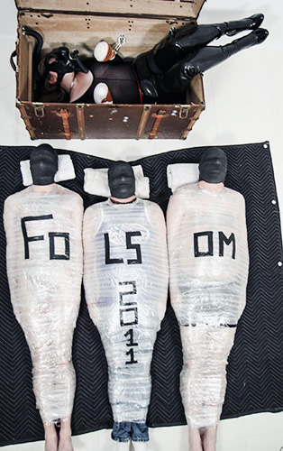
I was honored to be part of Ed's creativity, and took advantage of the situation to stretch out on his victims. Although mummies are usually deceased, I felt some strange lumps growing beneath me...what was that about??

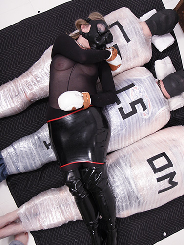

The following day we attended the infamous [Folsom Street Fair](http://www.folsomstreetfair.com/), one of the largest gatherings of the BDSM community on the planet. So many people wearing what they choose to wear and enjoying each others company all in one place —— and also plenty of choice of things to buy! I had wanted to go to Folsom for a very long time! When the day came round, I was incredibly nervous, especially going on the San Francisco J-line public streetcar all dressed up in my zentai and ponygirl outfit! However, once we got there it was fun to be able to walk down the street in my pony boots. I have never ever had so many people ask me if they could take my photograph —— so unusual! The center picture shows Daever on the left, Kinky Lil Pet Girl in the center, and me on the right. I was quite pleased with myself that I managed to last most of the afternoon in my pony boots (that Grimly had made me). I think my sore toes were worth it!

  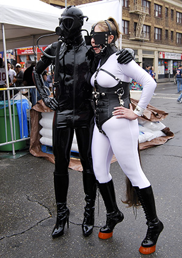
  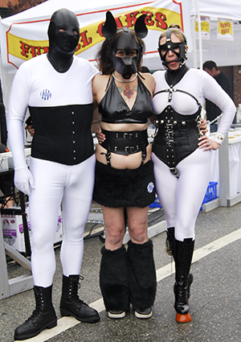
  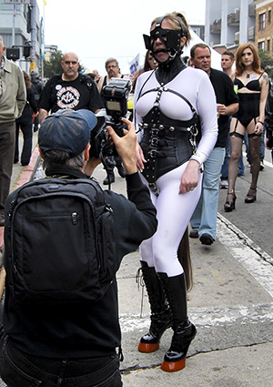
  
Here we are on the street at the fair. It's a carnival atmosphere - but definitely not for the kiddies! We met an interesting man in black in the photo on the left, in the middle shot, I'm with Daever and Pet Girl Kako. Everywhere at Folsom you can see 'perverted paparazzi', trying to capture all the madness for the local press as well as interested kinksters all over the world. 

After the thrills out on Folsom Street, of course there were parties all over town. We went home to change and get something to eat, and as usual, the house became crowded with many folks returning from their day at the fair.

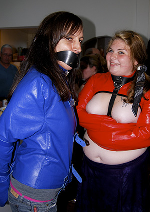
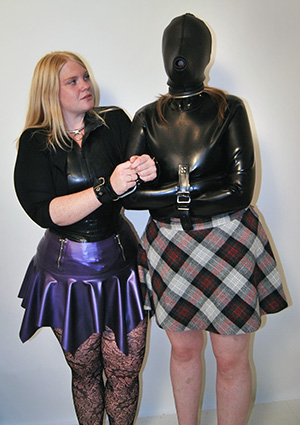

One of the great things about being around the Serious Bondage house was the number of great people we got to meet from all corners of the globe. The top left picture above shows Kinky Lil Pet Girl and her girl KT in straight jackets. Top right is SkratchedKitty in the latex skirt and me in the black straitjacket and hood. Below is my friend Daever's fingers feeding a chocolate to a caged victim!!

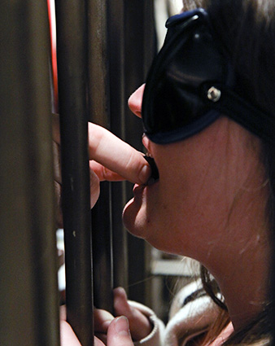

We also did the obligatory sightseeing in San Francisco —— riding on a cable car and also visiting Alcatraz. I had been so tempted to leave my new evil husband there! As another part of our sightseeing tour, we visited the viewpoint up at Twin Peaks. I was dressed in a latex butterfly straitjacket whilst JG-Leathers wore parts of his "Creature" outfit. I felt quite self-conscious being in fetish gear in public, yet people who asked us believed our cover story of it being a fashion shoot for a magazine! It's quite amazing what you can get away with when you have a couple of cameras and a lot of nerve. (The latex butterfly straitjacket is available on our retail website [HERE](http://www.lockedforinfinity.com/))

  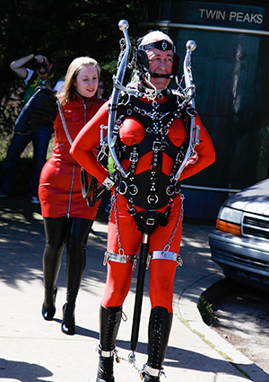
  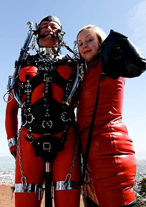
  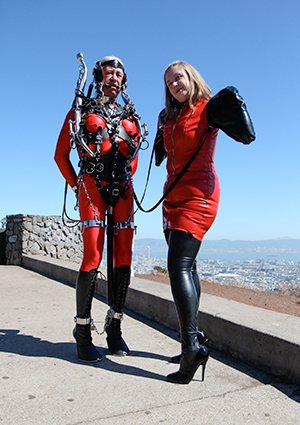
  
California provided us with lovely sunny weather so we got out and about quite a bit. Following JG Leathers in the 'Creature' harness, we headed up to the overlook at Twin Peaks where you can see 360 degrees all around San Francisco Bay. I'm sure we provided an interesting 'view' for the tourists as well.

When we got back to the house, we decided to have a bit more fun with some steel bondage and the garden hose —— it gets quite hot walking around in latex!

  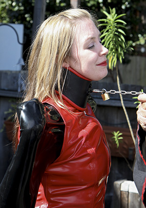
  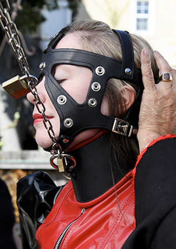
  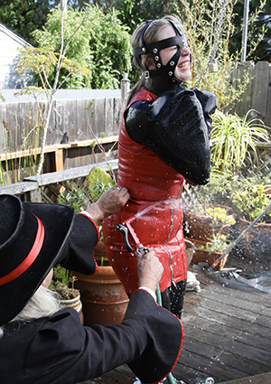
  
Resistance was pointless once I was fastened into the head harness out on the deck at the Serious Bondage Institute. The wetter the better? I guess that's what my tormentors were thinking. I say, 'Humph!'

## Back to Canada

Unfortunately, our time in San Francisco came to an end, but we had an absolutely fantastic stay and met such lovely people. We also managed to sneak in a visit with Joshua and E of [BDSM 24-7](http://www.bdsm247.com/) and also with Dr Black and Fredericka on the way back to Canada. On our return to Canada, we then went to visit Vancouver Island and to stay with Rubbert and Lady M. They threw a party whilst we were there, and we met up with Henry, yet another kinky engineer who makes the most interesting and unique stainless steel bondage devices. The first picture shows a stand that has infinite possibilities, including capturing me and MsPentYouth. The second picture shows a five-point restraint system Henry made, and the picture on the right shows a sort of J-stand that provided quite a cruel form of predicament bondage —— stay still and stay comfortable!

  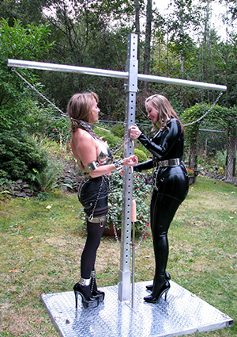
  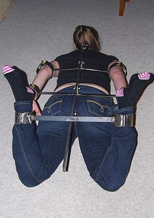
  
In the picture on the left, I was out in the garden with the gorgeous MssPentYouth where we got a bit 'tied up' with each other. On the right, the rigid hogtie restraint system shows what can happen when you let a mechanical engineer like Henry go with his fetish instincts.

  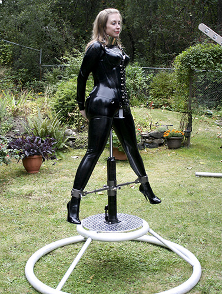
  
Another diabolical and effective device called the 'J-Stand'. The seat is supported by a hydraulic jack which can be raised until my legs are stretched tight. This forced me to stay as still as possible.

I also got to try the rack Henry had made. I have always been intrigued by modern designs of medieval torture, and so it was difficult to resist. It is perhaps hard to explain why such ancient tortures are a turn-on now, other than by saying, "Well, I'm a masochist!" It's something that visualizes my desire for bondage and pain.

  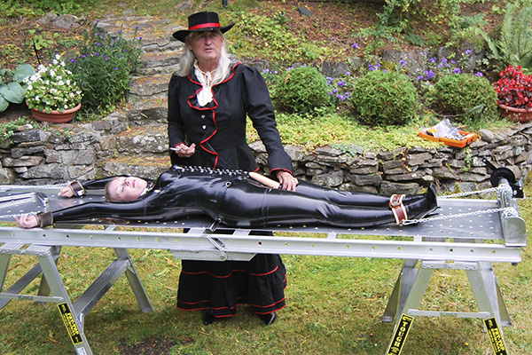
  
The same mechanical engineer Henry built this 20th century medieval metal rack. JG-Leathers stand by with a vibrator in case I need some distraction.

JG and Henry had recently helped Rubbert build a suspension point in the trees, and after seeing JG go up first and seeing how much it fun it looked to swing around, I got encased in Rubbert's leather sleepsack and hood and found out it's pretty good to have friends in high places! Being up in the trees was probably the highest I'd ever been whilst in bondage, and the mind boggled to wonder how much more amazing it would be if electrics or other torments were added to such a predicament! It felt very safe and very blissful just swaying in the breeze with the sounds of birds around me.

  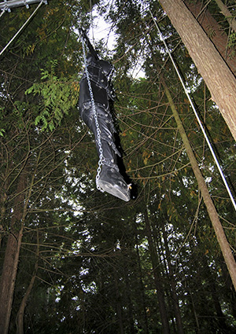
  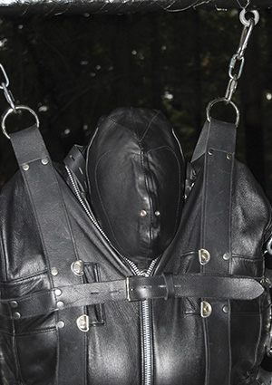
  
Everybody needs friends in high places, right? But I never expected to be in a high place myself. I was warm and snug in leather while swinging in the breeze. It was the first time I was in full bondage while surrounded by birdsong. I can't believe I did this.

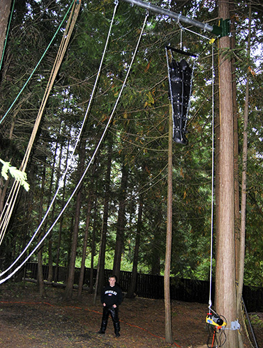

One of the highlights for me at Rubbert's place though, and definitely a highlight of the whole holiday, was getting to be Lady M's ponygirl for an afternoon. I've had a few opportunities for pony play in the past, both indoors at a warehouse space that holds a Fetish Club in Birmingham, and outdoors in Wales. However, whilst we have the right equipment, the harness, the tail and everything, even pony boots, Grimly and I have perhaps in the past not gotten into the headspace of Master and pony as much as we might have, given neither of us have much equestrian knowledge. What made playing with Lady M special was the fact that she has knowledge of horses and has been able to apply that to human ponygirl training, so I really felt as though I was her wayward ponygirl. I struggled with her commands to begin with, and ended up getting the crop on my thigh, but I learnt to understand the concepts behind the training and it added another dimension to a kink I already enjoyed.

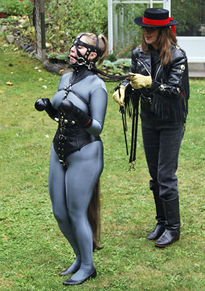
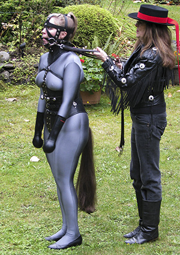

  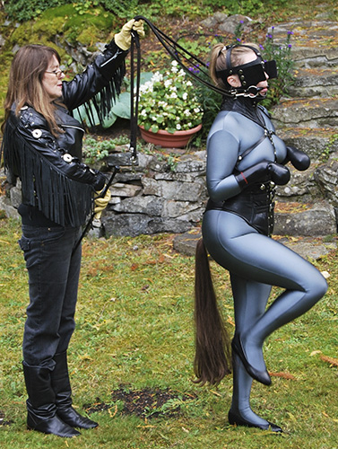
  
Pony play is so much fun, especially when with a trainer as expert as Lady M. It was a fantastic way to wind up our honeymoon - with a bit between my teeth. 

So there you have the highlights of our very kinky honeymoon. With hindsight, it seems bizarre that we planned a lot of this before we planned the wedding! However, such is the nature of our relationship that kink and BDSM play such a big part. Certainly BDSM does not form the only aspect of our life together, but is a very enjoyable one, and a part of us that has brought us in contact with so many amazing people who we consider friends. I'm glad that we got to celebrate "tying the knot" with so many diverse and interesting people. We can be reached on [FetLife](https://fetlife.com/) as [Grimly_Feendish](https://fetlife.com/users/17784) and [ThisGirlSub](https://fetlife.com/users/1697).